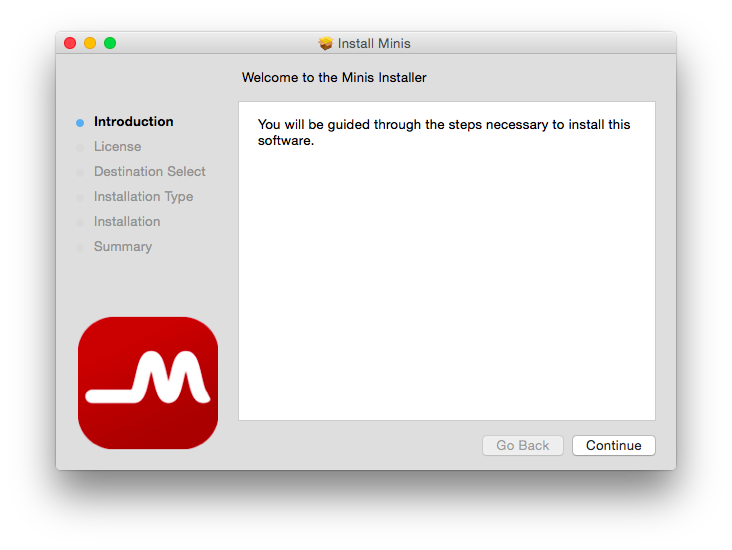
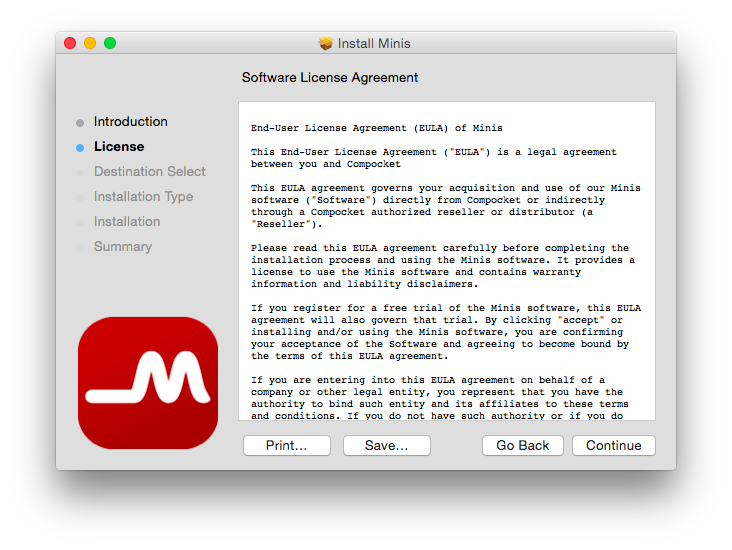
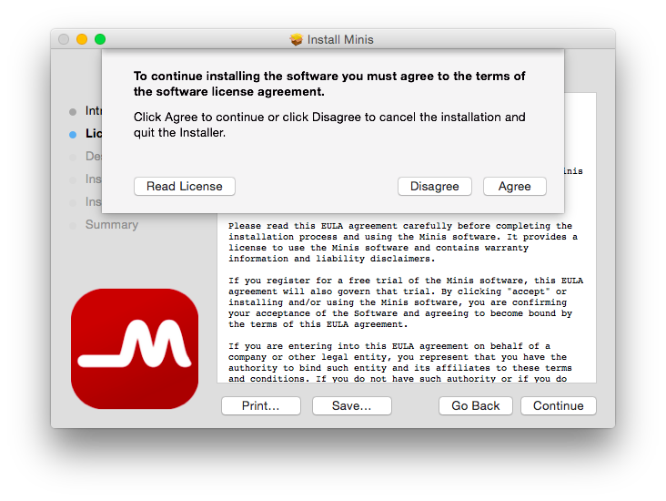
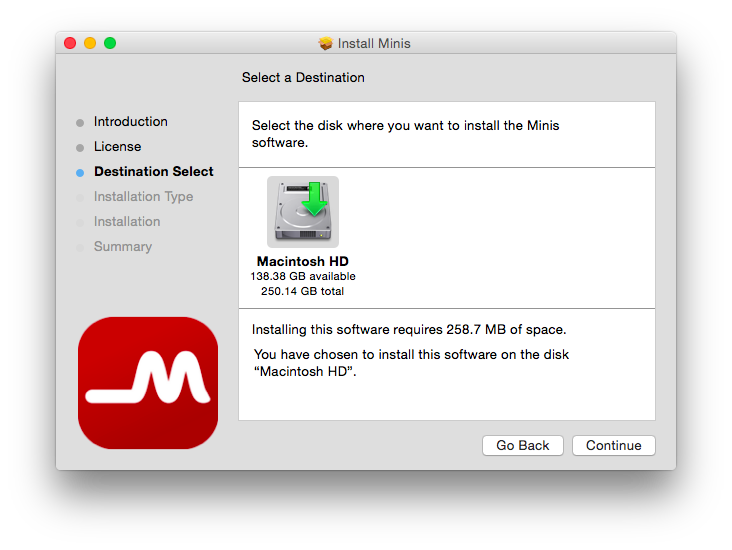
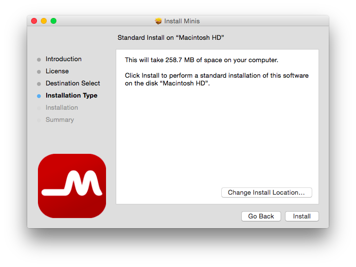
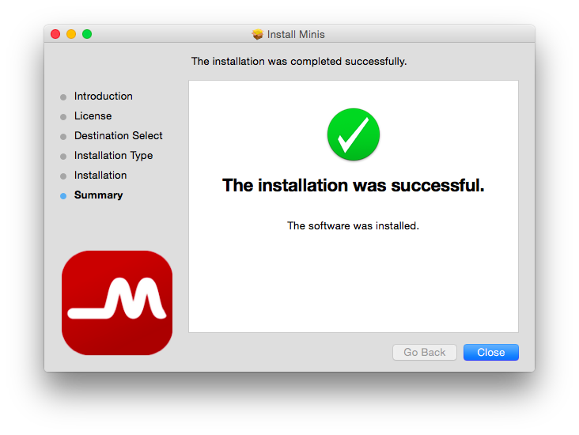

# Mac OS

Before you will go further, make sure you download the latest version of the application. You don't want to miss the new features.


~~The mac application software can only run in the computers that have dedicated graphic cards. If your mac only includes the integrated graphic card, the application will not work properly.~~ 

The above problem is solved with the version 1.2.0.


Run the **minis-x.x.x.pkg** file to start the setup. 

The installer will give the necessary information to install the application. Click **Continue**.

After the introduction, the Software License Agreement will be seen. After clicking **Continue**, you will be prompted to accept the license. To continue, you need to click **Agree** button.

Here you can select the destination, however it is recommended to leave this as it is. Click **continue**.

Click **Install** to continue with the installation. This will install the Minis.app and put it to the Application folder. In addition, it will install the necessary kext file to communicate with the USB device.

Now, you are ready to go! You can enjoy the software. You can connect the device to the PC via USB cable. After the connection is established, you will see the signals on the screen.

Before starting to use the software, we recommend you to go through the **User Guide/Desktop Application**.



