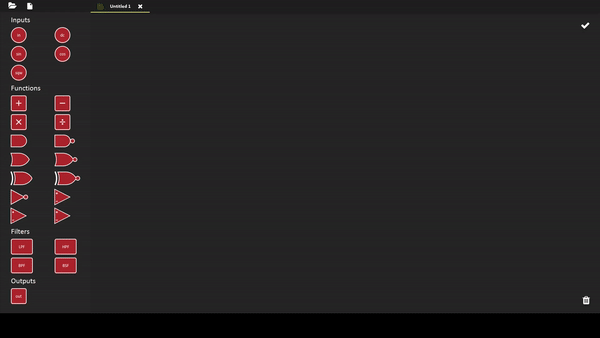

# Advanced Functions

As we said before, we try to give as much control as possible to the user. Giving only simple math operations is not enough for us. That's why we created the **Functions** page in which user can use advanced math operations with block diagram.


To use the blocks, you need to drag them to the area.  
To change the settings of the block, you need to right click on it.


### **Inputs**

\*\*\*\* : You can select a signal as input and determine the gain. 

 : It gives a dc signal with a desired offset.

 : It gives a sine signal with a desired offset, amplitude, phase and frequency.

 : It gives a cosine signal with a desired offset, amplitude, phase and frequency.

 : It gives a square signal with a desired offset, amplitude, phase and frequency.

### **Functions**

\*\*\*\* : The basic operations. All of them take 2 inputs.  

 : Logic AND gate. It takes 2 inputs.

 : Logic NAND gate. It takes 2 inputs.

 : Logic OR gate. It takes 2 inputs.

 : Logic NOR gate. It takes 2 inputs.

 : Logic XOR gate. It takes 2 inputs.

 : Logic XNOR gate. It takes 2 inputs.

 : Logic NOT gate. It takes only 1 input.


All the logic gates have 4 features in common. You can set the VCC+, VCC- , HIGH voltage and LOW voltage for every logic gate. 

If the input value is between LOW and VCC-, it is considered as logic 0. If the input value is between HIGH and VCC+, it is considered as logic 1. The values between LOW and HIGH are considered as indeterminate. 

If the output of the logic is 1, corresponding analog value is VCC+. If the output of the logic is 0, corresponding analog value is VCC-.


 : Comparator. If Input1 &gt; Input2, the output is VCC+, otherwise VCC-.

 : Inverting Schmitt Trigger. 

 : Non-inverting Schmitt Trigger.

### **Filters**

 : Low Pass Filter.

 : High Pass Filter.

 : Band Pass Filter.

 : Band Stop Filter.


All the filters are Butterworth filters.   
For LPF and HPF, you can select the order and the cut-off frequency.  
For BPF and BSF, you can select the order, the centeral frequency and the bandwidth.


### Outputs

 : The output. To complete the block diagram, you need to add this block to the end. Every out block corresponds a new signal.

As you see in the gif, you can drag all the desired blocks to the area. When they are added, the input circles, the output rectangle and line are added to the shape if necessary. 


To make a connection between two blocks, you have three options:  
1\) Press the mouse button when it is on the input circle, release it when it is on the output line.  
2\) Press the mouse button when it is on the output line, release it when it is on the input circle.  
3\) Right click to any block\(except inputs\) and select the block that you want to connect.


After you connect two blocks, you see the equation on the line, if possible. Every change in the dependent blocks updates the equation. 


You can move any blocks one by one. However, if you want to move multiple of them at the same time, you need to drag the mouse and draw a rectangle to select multiple blocks.


If you move the blocks to the trash, it will delete them. Or alternatively, you can click on the trash and select the block that you want tot delete. 


CTRL + A : Select all blocks.  
CTRL + C : Copy the selected blocks. \(You can select any number of blocks by the rectangle mentioned above.\)  
CTRL + V : Paste the copied blocks.  
CTRL + Z : Undo operation  
CTRL + Y : Redo operation  
CTRL + S : Save the current workspace.  
DEL : When the mouse is hovering on a block, if you press DEL, you delete that block. If that block is a selected block and there are more selected blocks, all the selected blocks are deleted. 


When you click the  button, the software checks the connections and create a new signal that is calculated according to the block diagram. If there are any problems in the connection, the software shows the error message. 


The signal source for the "in" should be selected.  
There should be no loops in the graph.  
The input of every "out" blocks should be connected.  
The input of every block that is a part of a path which is ended with "out" should be connected.


The color of **SAVE** button indicates whether the current workspace is saved or not. By clicking on it, you can save the workspace. 

The **CLOSE** button in each workspace closes the workspace when clicked.

The **FOLDER** button prompts user to open a file with .**mws** extension. You can re-open the saved workspaces by doing this.

The **FILE** button opens a new workspace.

