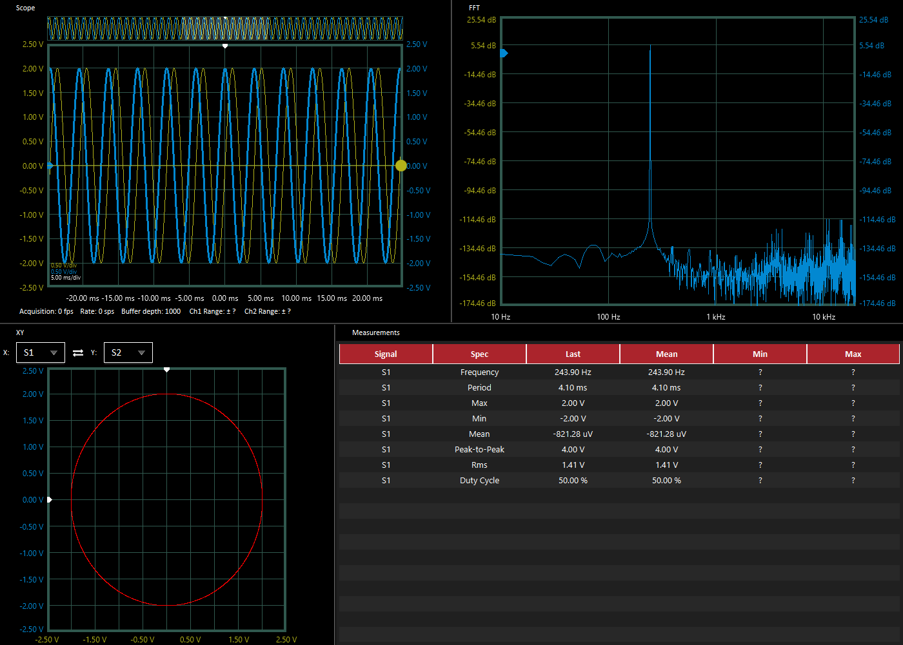

# Export

The software provides the user with 4 different export option: **PNG, PDF, XLSX** and **MAT.**

If you export as **PNG**, the application saves the screenshot of the area between left and right control panel as image file.

If you export as **PDF**, the application saves the screenshot of the area between left and right control panel together with a table which consists of the measurements as pdf file.

If you export as **XLSX**, the application creates a XLSX file that includes 2 tabs: Time-domain, Frequency-domain. It takes the values from the buffer and fft calculations.

 


To see the time-domain values of the signal, it should be visible.

To see the frequency-domain values of the signal, it should be visible and "Show FFT" option should be selected for that signal.


If you export as **MAT**, the application creates a MAT file that includes a struct with a name "Signals". It includes 2 fields: **TimeDomain** and **FrequencyDomain**.  Both of them contain as many elements as the number of signals. 

Each elements in the TimeDomain field contains as many structs as the buffer length, lets say $$n$$. Each struct consists of **t** and **V** fields which correspond to time and voltage values respectively.

Each elements in the Frequency field contains $$n/2 + 1$$ structs. Each struct consists of **f** and **dB** fields which correspond to frequency and amplitude values respectively.

