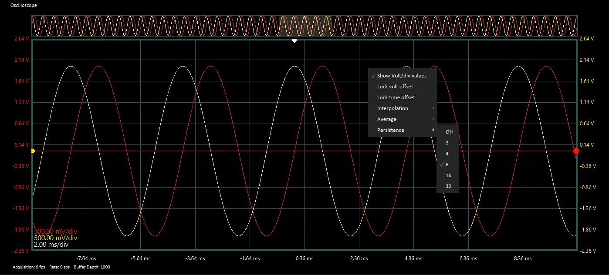

# Persistence

In Minis, the persistence settings determine the number of previous frames to be drawn on the oscilloscope screen. 


You can specify the number of frames to be shown on the graph by:

* Right clicking on the oscilloscope window.
* Opening the Preferences/Control Settings section.


