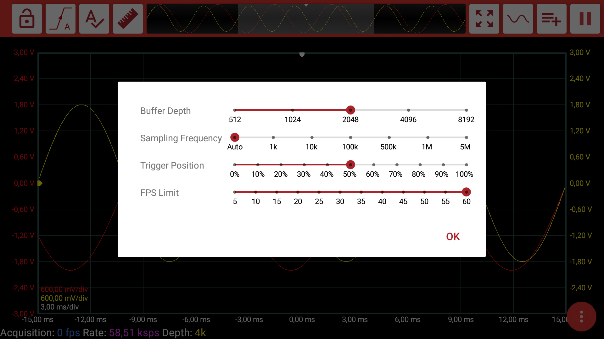

# Buffer Settings

We try to make the software as flexible as possible for the users. We try to give the control to the users as much as possible. Buffer settings can be an example for it.

When you click on the **Buffer Navigator**, you open the Buffer Settings window.

**Buffer Depth:** You can change the buffer depth. \(Default: 2048\)  
**Sampling Frequency:** If auto is not selected, ADC sampling frequency is fixed. If auto is selected, ADC sampling frequency is determined by the time/div. \(Default: Auto\)  
**Trigger Position:** You can change the horizontal trigger position of the buffer. \(Default: 50%\)  
**FPS Limit:** \(Default: 60\)

