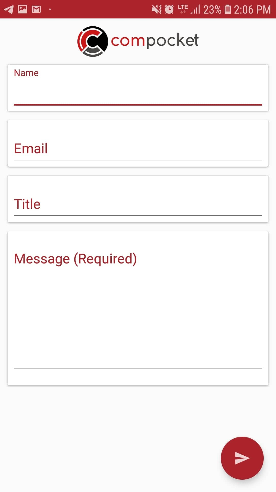

# Contact

We value your feedbacks and ideas, also care your problems. That's why we added a **Contact** window to our application.

In this form, we need the **Name** for writing you back with your name, the **E-mail** for replying you back with an e-mail, the **Title** for understanding the main subject of the message and the **Message** for feedback, ideas or problems. Only the **message** field is required, the rest of them is optional. 


If you want a reply for your message, you need to type a valid email address.


