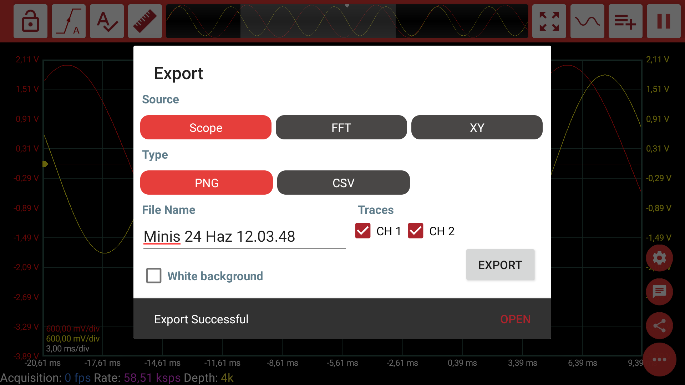

# Export


In the time being, the mobile application supports **PNG** and **CSV** export. We are planning to add **PDF** and **MAT** exports in the near future.



You can find all your exports in **Internal storage/minis** folder.


You can open up the Export dialog by clicking on the Share button.

After you select the source \(Scope, FFT or XY\) and the type \(PNG or CSV\) you can export the selected graph by clicking on the "Export" button. App may ask for your permission to store the export in the internal storage.

