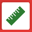

# Measurements

You can open the measurement view by clicking on the ruler icon  in the toolbar.

If you click on the measurement view, a dialog pops up in which you can add or remove measurements.


You can customize the measurement view from settings.


