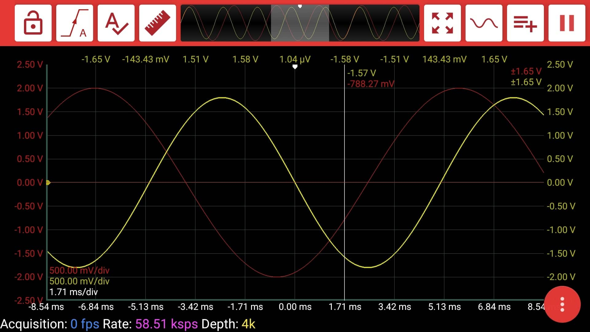
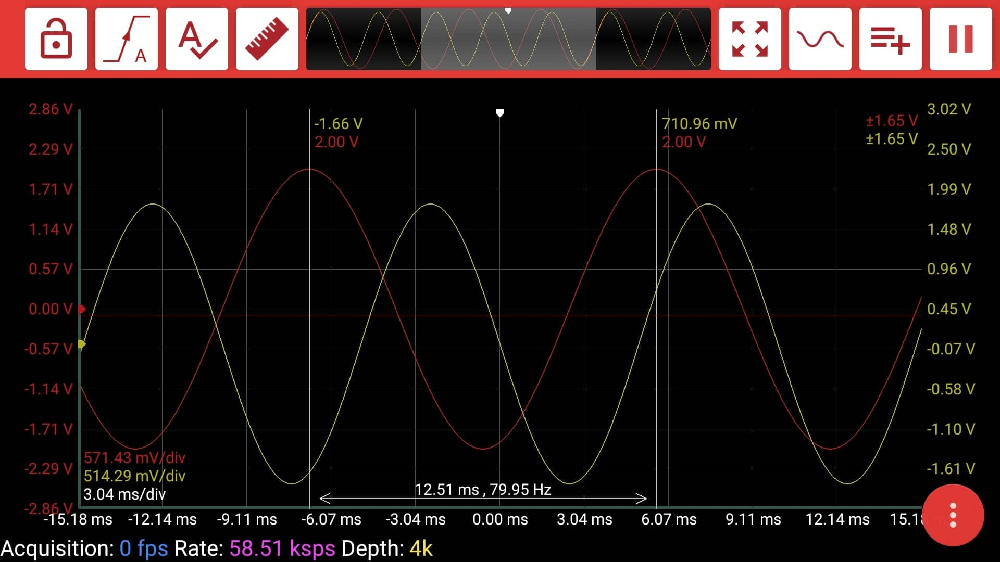
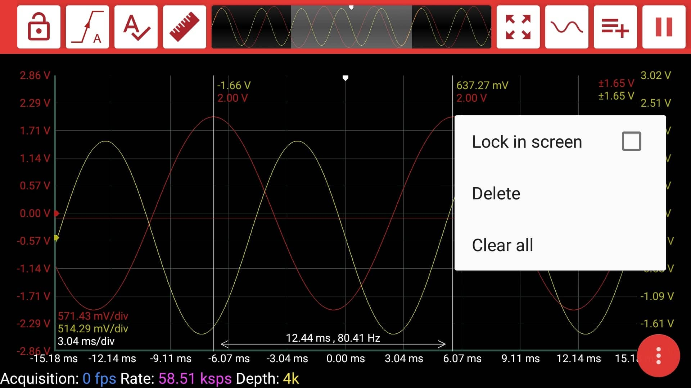
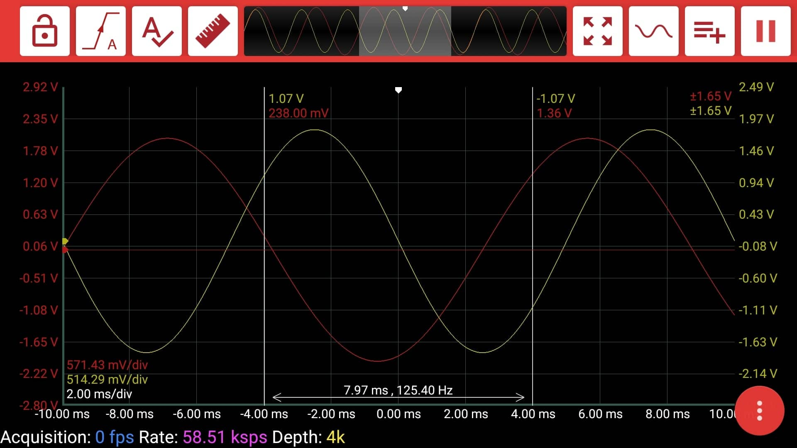
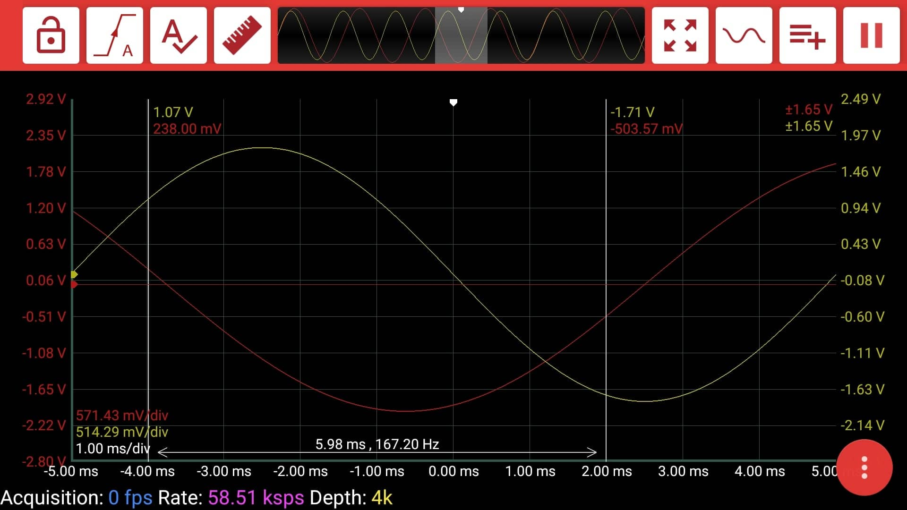

# Cursors

Cursors are one of the fundamental features for oscilloscopes. They will help you find the voltage at the determined time or the time difference between two determined points.

To add a cursor to the scope, you just need to long click on it. After adding the cursor, you can drag it wherever you want. If you drag the cursor out of the screen, it is deleted.  

At the top of the cursor, you see the value of every signal at the time where the cursor is located. 

If you add another cursor, you see also the time difference and the frequency value\(reciprocal of the time difference\).

When you click on the cursor, you will see a menu. "Delete" and "Clear all" options are self explanatory. Another option is "Lock in screen". If it is selected, the cursor location is fixed to the point on the screen. If it is not,  the cursor is fixed to the time variable. 

In the below pictures, you will see the difference between time-fixed and point-fixed cursors. The left cursor is time-fixed, the right one is point-fixed.

As you see, the left cursor\(time-fixed\) is still located at -4ms, whereas the right cursor\(point-fixed\) is still in the same position on the screen.

