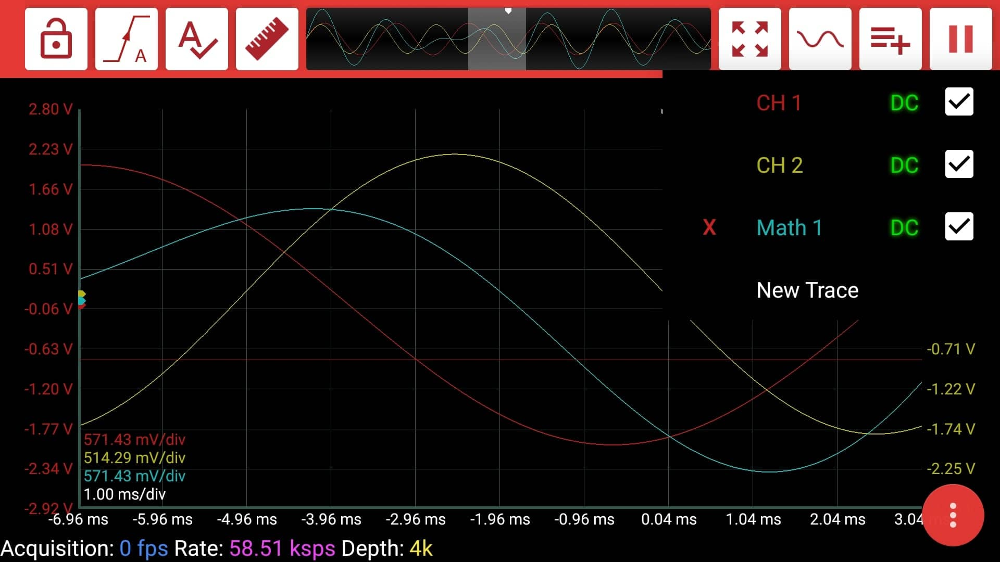
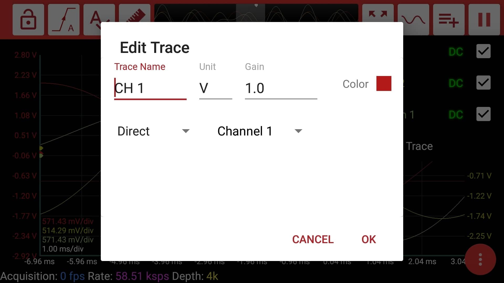

# Signal Settings

There are many settings of the signals that you might change. In this page, you learn how to change all these settings for the signal.

You can open the signal settings menu by clicking the second button from the right.

In every row in the menu, you can see the signal name, ac/dc coupling and the show/hide button. Derived signals can be removed by clicking the "X".

By clicking on the signal name, you can set the **trace name**, **unit**, **gain** and **color** of the signal. 

