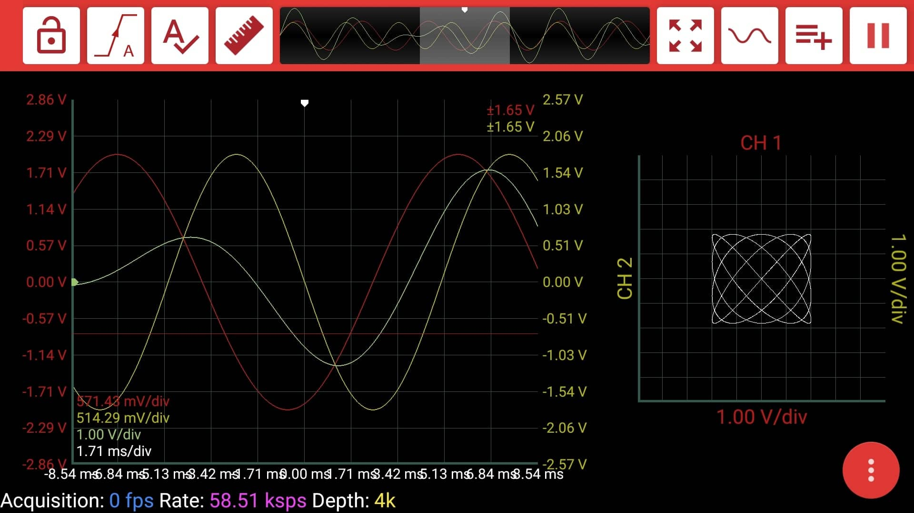
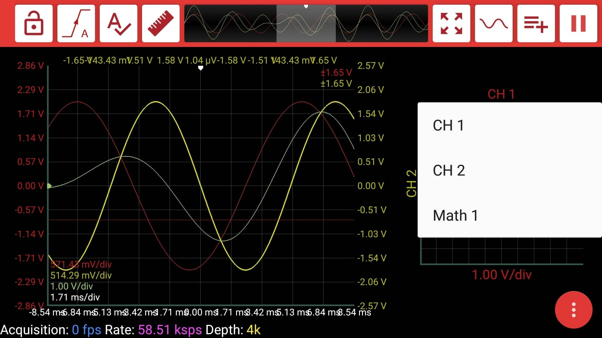

# XY Graph

In addition to time-domain and frequency domain analysis, sometimes you may need to observe the correlation between the two signal. This graph helps users to identify signal frequencies ratio, their amplitude and the phase shift of one signal relative to the other one.


To open the XY window:  
    Click the Graph button.  
    Select **FFT**.


You can change the signals for the x and y axes by clicking on the signal name.

